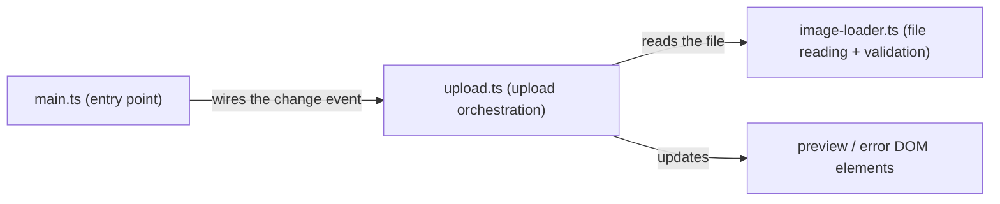

> Generated by /vibe:docs — manual edits will be overwritten; use README for hand-written content.

# Architecture

The app is a small, framework-free TypeScript site built with Vite. It has three source modules, each with one job.

## Modules

**`main.ts`** — Bootstraps the page: renders the upload UI (title, description, file input, preview image, error message) into `#app`, and wires the file input's `change` event to `upload.ts`. Resets the input's value after every selection so choosing the same file twice in a row still triggers a change event.

**`upload.ts`** — Orchestrates one file selection: does nothing if no file was chosen (the picker was cancelled), rejects unsupported types, reads valid images and shows the preview, and shows an error if reading or displaying the image fails. Takes the preview and error elements as plain arguments rather than looking them up itself, which is what makes it testable without spinning up the whole page.

**`image-loader.ts`** — Two pure functions with no DOM dependency: `isSupportedImageType` (rejects non-images and SVG, since the grid/palette detection features built later need raster pixel data) and `readImageFile` (wraps `FileReader` in a promise that resolves with a data URL or rejects on read failure).

## Data flow

1. The user picks a file in the `#image-input` field.
2. `main.ts`'s change handler reads `input.files[0]` and calls `upload.ts`.
3. `upload.ts` validates the type via `image-loader.ts`; on success it reads the file (also via `image-loader.ts`) and sets the preview image's `src` to the resulting data URL; on failure it shows an inline error and hides the preview.
4. If the file passed the type check but isn't actually a valid image (a corrupted file), the preview ``'s own `onerror` handler catches the browser's decode failure and swaps back to the error message.
