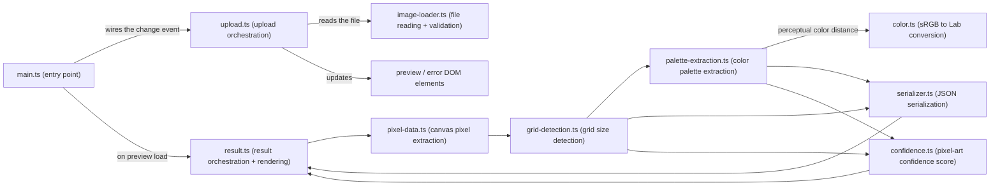

> Generated by /vibe:docs — manual edits will be overwritten; use README for hand-written content.

# Architecture

The app is a small, framework-free TypeScript site built with Vite. Selecting an image both shows an instant preview and, once that preview has decoded, runs the full detection pipeline and displays its result next to the original.

```mermaid
flowchart LR
    main["main.ts (entry point)"] -->|wires the change event| upload["upload.ts (upload orchestration)"]
    upload -->|reads the file| loader["image-loader.ts (file reading + validation)"]
    upload -->|updates| dom["preview / error DOM elements"]
    main -->|on preview load| result["result.ts (result orchestration + rendering)"]
    result --> pixeldata["pixel-data.ts (canvas pixel extraction)"]
    pixeldata --> griddetect["grid-detection.ts (grid size detection)"]
    griddetect --> palette["palette-extraction.ts (color palette extraction)"]
    palette -->|perceptual color distance| color["color.ts (sRGB to Lab conversion)"]
    griddetect --> serializer["serializer.ts (JSON serialization)"]
    palette --> serializer
    serializer --> result
    griddetect --> confidence["confidence.ts (pixel-art confidence score)"]
    palette --> confidence
    confidence --> result
```

## Modules

**`main.ts`** — Bootstraps the page: renders the upload UI (title, description, file input, preview image, error message, result comparison, palette, download link) into `#app`, and wires the file input's `change` event to `upload.ts`. Resets the input's value after every selection so choosing the same file twice in a row still triggers a change event. Also wires the preview image's `load` event to `result.ts`'s orchestrator (passing along the selected file's name, used to name the downloadable JSON), and clears the previous result synchronously on every new selection, before the new file's outcome is known.

**`upload.ts`** — Orchestrates one file selection: does nothing if no file was chosen (the picker was cancelled), rejects unsupported types, reads valid images and shows the preview, and shows an error if reading or displaying the image fails. Takes the preview and error elements as plain arguments rather than looking them up itself, which is what makes it testable without spinning up the whole page.

**`image-loader.ts`** — Two pure functions with no DOM dependency: `isSupportedImageType` (rejects non-images and SVG, since the grid/palette detection features built later need raster pixel data) and `readImageFile` (wraps `FileReader` in a promise that resolves with a data URL or rejects on read failure).

**`grid-detection.ts`** — Pure function `detectPixelGridSize`: scans up to 24 full rows and 24 full columns of an image's pixel data, pools same-color segment lengths per axis, and takes the most frequent length as the logical pixel size. Returns the detected pixel size plus the image's width/height expressed in logical pixels rather than raw pixels, plus a `gridRegularity` score (0-1): the share of scanned runs that actually match that size, forced to 0 whenever no consistent size was found at all (`pixelSize` of 1). No DOM dependency, so it's tested with synthetic pixel data.

**`pixel-data.ts`** — `extractPixelData`: reads a loaded ``'s real pixel data via an offscreen canvas (`drawImage` + `getImageData`), at the image's natural resolution. Not covered by automated tests — see [docs/testing.md](testing.md).

**`palette-extraction.ts`** — Pure function `extractColorPalette`: given the raw pixel data and a detected grid, samples one raw pixel per logical grid cell (the one nearest the cell's center), then repeatedly merges the two perceptually closest colors (in Lab space, via `color.ts`) while they stay under a "just noticeable difference" threshold, so near-identical colors caused by compression artifacts collapse into one palette entry. Returns the indexed list of distinct colors plus their count. Guards against pathological input (e.g. grid detection finding no grid on a large, noisy image) by coarsely bucketing colors first whenever there would otherwise be too many to merge pairwise in reasonable time.

**`color.ts`** — Three pure functions with no dependency on the rest of the app: `rgbToLab` (sRGB to CIE Lab conversion), `labDistance` (CIE76 perceptual distance between two Lab colors), and `rgbToHex` (channel values to a `#rrggbb` string), used by `palette-extraction.ts` and `serializer.ts`.

**`serializer.ts`** — Pure function `serializePixelArt`: given the raw pixel data, the detected grid, and the extracted palette, resamples each grid cell's color (the same way `palette-extraction.ts` samples it) and assigns it to the closest palette entry in Lab space, so a pixel whose original shade was folded into another during palette extraction still ends up pointing at the entry that absorbed it. Returns one JSON-ready object: grid width/height, the palette as `{ index, hex, alpha }` entries, and a flat, row-major array of one palette index per logical pixel.

**`confidence.ts`** — Pure function `computeConfidence`: averages two 0-1 signals — the detected grid's `gridRegularity` and a palette-size score (1 at 16 colors or fewer, 0 at 256 or more, sliding linearly in between, since pixel art conventionally uses a small, fixed palette) — into an overall score, a plain-word verdict ("Looks like pixel art" / "Doesn't look like pixel art" at the 50% mark), and a one-clause explanation naming which of the two signals is weak when they disagree, or both/neither when they agree. See `.vibe/decisions/009-grid-regularity-exposed-from-detection.md` for why grid regularity is computed inside grid detection rather than here.

**`result.ts`** — Ties the whole pipeline to the screen. `resetResult` hides the reconstruction, palette, download link, and confidence verdict, and clears any previous swatches, downloadable content, and verdict text (called on every new file selection, before that file's outcome is known, so nothing stale ever lingers). `renderPalette` builds one labeled color swatch per palette entry, in index order, each showing its hex code as text and its color over a checkerboard backdrop so a transparent color reads as transparent rather than as a flat, possibly-misleading opaque one. `renderReconstruction` draws the reconstruction straight onto a `<canvas>` sized to exactly the grid's width and height (one canvas pixel per logical pixel, styled with `image-rendering: pixelated` and the grid's own aspect ratio), reading colors only from the serialized JSON so it can never be influenced by the original image's actual pixels — see `.vibe/decisions/007-reconstruction-rendered-to-live-canvas.md`. `renderDownloadLink` sets the download link's `href` to a `data:application/json` URL holding the exact serialized JSON, and its filename via `toJsonFilename` (the source file's name with its extension replaced by `.json`, or a fixed fallback name when none is available) — see `.vibe/decisions/008-json-download-via-data-url.md`. `renderConfidence` writes the verdict, its score as a rounded percentage, and the explanation as one sentence into a `role="status"` element, so assistive tech announces it the same way the rest of a newly-produced result appears. `displayResult` is the orchestrator: it runs `pixel-data.ts` → `grid-detection.ts` → `palette-extraction.ts` → `serializer.ts` / `confidence.ts` and feeds the results to the four render functions above. `resetResult`, `renderPalette`, `renderDownloadLink`, `toJsonFilename`, and `renderConfidence` are covered by automated tests; `renderReconstruction`/`displayResult` are not, for the same reason as `pixel-data.ts` — see [docs/testing.md](testing.md).

## Data flow

**Upload/preview (live):**
1. The user picks a file in the `#image-input` field.
2. `main.ts`'s change handler calls `resetResult` immediately, then reads `input.files[0]` and calls `upload.ts`.
3. `upload.ts` validates the type via `image-loader.ts`; on success it reads the file (also via `image-loader.ts`) and sets the preview image's `src` to the resulting data URL; on failure it shows an inline error and hides the preview.
4. If the file passed the type check but isn't actually a valid image (a corrupted file), the preview ``'s own `onerror` handler catches the browser's decode failure and swaps back to the error message. Either way, the result section stays hidden — `displayResult` only ever runs after a successful decode.

**Grid detection, palette extraction, JSON serialization, and result display (live):** once the preview `` fires its `load` event (a successful decode), `main.ts` calls `result.ts`'s `displayResult`, which reads the image's raw pixels via canvas (`pixel-data.ts`), detects its logical pixel grid (`grid-detection.ts`), extracts its color palette (`palette-extraction.ts`), serializes both into JSON (`serializer.ts`) and into a confidence verdict (`confidence.ts`), then renders the reconstruction, the palette swatches, the JSON download link, and the confidence verdict next to the original.
