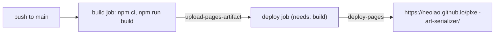

> Generated by /vibe:docs — manual edits will be overwritten; use README for hand-written content.

# Deployment

The site is a static build (`dist/`), deployed to GitHub Pages by `.github/workflows/deploy.yml`.

## How it works

1. A push to `main` (or a manual run from the Actions tab, via `workflow_dispatch`) triggers the workflow.
2. The `build` job installs dependencies (`npm ci`), builds the site (`npm run build`) with `GITHUB_PAGES=true` set, and uploads `dist/` as a Pages artifact.
3. The `deploy` job only runs if `build` succeeds (`needs: build`) and publishes that artifact to GitHub Pages. A failed build never triggers `deploy`, so a broken commit cannot overwrite the live site.
4. `concurrency: { group: "pages", cancel-in-progress: false }` lets an in-flight deploy finish rather than cancelling it mid-upload.

## The subpath base path

This repo is not a `<user>.github.io` repo, so it's served as a project page at a subpath (`/pixel-art-serializer/`), not at the domain root. `vite.config.ts` sets Vite's `base` to that subpath only when the `GITHUB_PAGES` environment variable is set — which only the workflow's build step does. Local `npm run dev`/`npm run build`/`npm run preview`, and the `run-pixel-art-serializer` skill, are unaffected and keep using root-relative paths. See `.vibe/decisions/010-conditional-vite-base-for-pages.md`.

## Node version

CI and local development are both pinned to the Node version in `.nvmrc` (also declared in `package.json`'s `engines` field), so they can't silently drift onto different Node majors.

## Verifying a deploy

Nothing here is unit-testable — a deploy is verified by watching the workflow run in the Actions tab and then loading the live URL for real (confirm it returns 200, its bundled assets load without 404s, and the upload-detect-serialize-display flow works end to end against the deployed page, not just against a local dev server).
